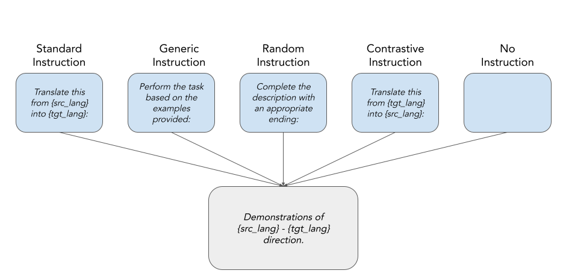
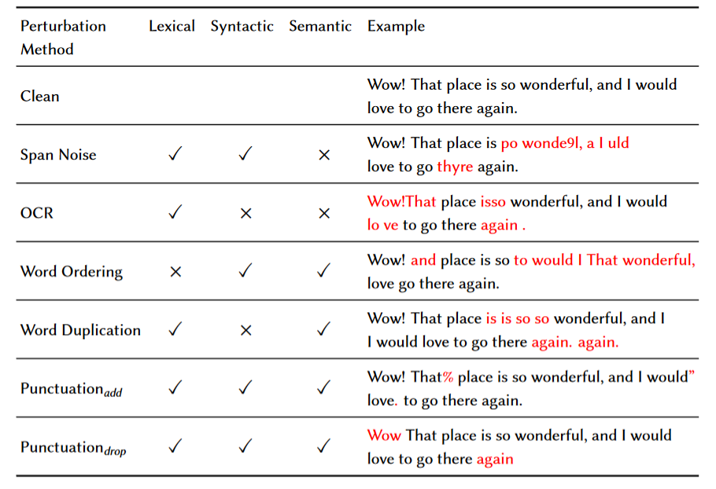
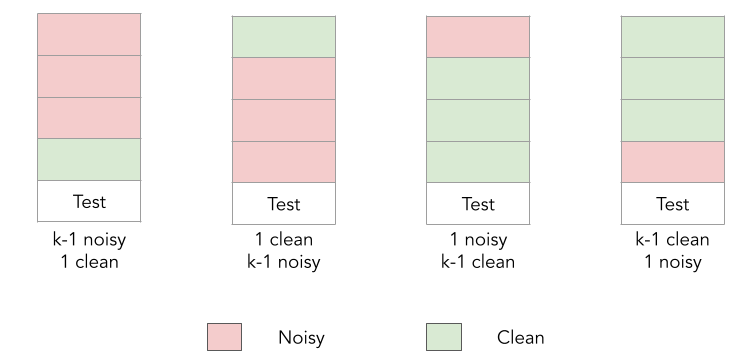

# in-context-mt-analysis

[📜 Paper](https://arxiv.org/abs/2401.12097) | [📔 Slides](https://docs.google.com/presentation/d/1ufJZ0qkC8mBUnBQm1w1T-7YgPPgYGK_KlaJCkbzcXd0/edit?usp=drive_link) | [▶️ Video](https://underline.io/events/466/sessions/18223/lecture/102929-an-empirical-study-of-in-context-learning-in-llms-for-machine-translation)

The official code repository associated with the paper titled "[An Empirical Study of In-context Learning in LLMs for Machine Translation](https://arxiv.org/abs/2401.12097)" (ACL 2024 Findings). In this work, we comprehensively study the in-context machine translation capabilities of LLMs.

## Overview

> Recent interest has surged in employing Large Language Models (LLMs) for machine translation (MT) via in-context learning (ICL) (Vilar et al., 2023). Most prior studies primarily focus on optimizing translation quality, with limited attention to understanding the specific aspects of ICL that influence the said quality. To this end, we perform the first of its kind, an exhaustive study of in-context learning for machine translation. We first establish that ICL is primarily example-driven and not instruction-driven. Following this, we conduct an extensive exploration of various aspects of the examples to understand their influence on downstream performance. Our analysis includes factors such as quality and quantity of demonstrations, spatial proximity, and source versus target originality. Further, we also investigate challenging scenarios involving indirectness and misalignment of examples to understand the limits of ICL. While we establish the significance of the quality of the target distribution over the source distribution of demonstrations, we further observe that perturbations sometimes act as regularizers, resulting in performance improvements. Surprisingly, ICL does not necessitate examples from the same task, and a related task with the same target distribution proves sufficient. We hope that our study acts as a guiding resource for considerations in utilizing ICL for MT.

## Installation

```bash
# Clone the github repository and navigate to the project directory.
git clone https://github.com/PranjalChitale/in-context-mt-analysis.git
cd in-context-mt-analysis

# Create a virtual environment using conda
conda create -n icl_mt python=3.10 -y
conda activate icl_mt

# Install all the dependencies and requirements associated with the project.
conda install pip -y
python3 -m pip install --upgrade pip
python3 -m pip install -r requirements.txt
```

## Data Preparation

```bash
python src/download_data.py --dataset_name $dataset_name --langs $langs
```

**Arguments**
  * `--dataset_name`: The name of the dataset to download from the Hugging Face Hub. Choices are `facebook/flores` and `ai4bharat/IN22-Gen`. Default is `facebook/flores`.

  * `--langs`: A list of language codes indicating the languages and scripts to download. For example, eng_Latn hin_Deva mar_Deva.

## Experiments

### Instruction Variants
In this experiment, we keep the demonstrations fixed and consider different instruction variants to understand the effect of the instruction variant on the downstream performance.



**Experiment-specific Arguments**

`--instruction_type` (str):
Type of instruction variant to use with the in-context demonstrations. Choices are:
* `standard`: Use the standard instruction variant.
* `generic`: Use the generic instruction variant.
* `random`: Use the random instruction variant.
* `contrastive`: Use the contrastive instruction variant.
* `no_instruct`: Do not use any instruction variant.

<br>

**Example Usage**

```bash
python3 src/causal_lm_eval_instruct.py \
--model_name_or_path $model_name \
--tokenizer_name_or_path $model_name \
--dev_fname $dev_fname \
--test_fname $test_fname \
--src_lang $src_lang --tgt_lang $tgt_lang \
--n_shot $n_shot  \
--batch_size $batch_size \ 
--max_new_tokens 256 \
--instruction_type $instruction_type
```

### Demonstration Perturbation

* In this experiment, we keep the instruction fixed while apply perturbations to the demonstration to understand what effect does perturbations to the demonstration have on the downstream performance.
* We also aim to understand the effect of the perturb direction (source/target) on the performance.

#### Homogeneous Perturbation

In this experiment all the demonstrations are perturbed to the same degree.

**Demonstration Perturbation Attacks**



**Experiment-specific Arguments**

- `--perturb` (bool): Apply perturbations to in-context demonstrations. Default is False.
- `--perturb_direction` (str): Specify whether to apply perturbations on the source or target side. Choices are `source` and `target`. Default is `target`.
- `--attack_type` (str): Choose an attack type to apply on the input text during perturbation. Choices are `span_noise`, `word_duplication`, `ocr`, `word_order`, `punctuation_drop_attack`, `punctuation_add_attack`.
- `--noise_percentage` (float): Percentage of characters to inject noise into during perturbation. Default is 0.1.

**Example Usage**

```bash
python3 src/causal_lm_eval_perturb_homo.py \
--model_name_or_path $model_name \
--tokenizer_name_or_path $model_name \
--dev_fname $dev_fname \
--test_fname $test_fname \
--src_lang $src_lang \
--tgt_lang $tgt_lang \
--n_shot $n_shot \
--batch_size $batch_size \
--max_new_tokens 256 \
--perturb \ 
--perturb_direction $perturb_direction \
--attack_type $attack_type \
--noise_percentage $noise_percentage
```

#### Heterogeneous Perturbation

* In this experiment we aim to determine if spatial proximity to the test example has an effect on the downstream performance or not.
* For this experiment we consider a 4-shot setting and consider 4 heterogeneous types.

**Experiment-specific Arguments**

* `--heterogeneous` (bool): Flag to enable heterogeneous perturbations.
* `--heterogeneous_type` (str): Specifies the configuration of clean and noisy demonstrations. The available options and their configurations are as follows:
  - Type I: k-1 clean examples and 1 noisy example.
  - Type II: 1 clean example and k-1 noisy examples.
  - Type III: 1 noisy example and k-1 clean examples.
  - Type IV: k-1 noisy examples and 1 clean example.



**Example Usage**

```bash
python3 src/causal_lm_eval_perturb_hetero.py \
--model_name_or_path $model_name \
--tokenizer_name_or_path $model_name \
--dev_fname $dev_fname \
--test_fname $test_fname \
--src_lang $src_lang --tgt_lang $tgt_lang \
--n_shot $n_shot --batch_size $batch_size --max_new_tokens 256 \
--perturb \ 
--perturb_direction $perturb_direction \
--heterogeneous \
--heterogeneous_type $type \
--attack_type $attack_type \ 
--noise_percentage $noise_percentage
```

### Transitivity Experiment

* In this experiment, we have a two-fold objective we aim to study if models can make transitive associations in-context and whether models are robust to misalignment or misinformation presented in the context.
* We consider a Pivot translation based setup and consider 4 alignment scenarios.

**Experiment-specific Arguments**

The following arguments are used in the experiment:
* `--src_to_pivot_fname`: Name or path of the test dataset for evaluation between the source language and the pivot language.
* `--pivot_to_tgt_fname`: Name or path of the test dataset for evaluation between the pivot language and the target language.
* `--src_lang`: Source language code.
* `--pivot_lang`: Pivot language code.
* `--tgt_lang`: Target language code.
* `--variant`: This argument defines the alignment scenario being tested.

**Alignment Scenarios**

The experiment tests four alignment scenarios:
- ```Case I: All aligned (FLORES i, i, i)```\
All language pairs (source to pivot, pivot to target) are aligned correctly.
- ```Case II: Pivot is misaligned (i, j, i)```\
The pivot language is misaligned. This means the pivot translations are incorrect or shifted.
- ```Case III: X is misaligned (i, j, j)```\
The source to pivot translation (X’s translation) is misaligned, disregarding the pivot and target alignment.
- ```Case IV: Y is misaligned (i, i, j)```\
The target language is misaligned. This means the target translations are incorrect or shifted.

**Example Usage**

```bash
python3 causal_lm_eval_transitivity.py \
--model_name_or_path $model_name \
--tokenizer_name_or_path $model_name \
--src_to_pivot_fname $src_to_pivot_fname \
--pivot_to_tgt_fname $pivot_to_tgt_fname \
--pivot_lang $pivot_lang \
--src_lang $src_lang \
--tgt_lang $tgt_lang \
--batch_size 16 \
--max_new_tokens 256 \
--variant $variant
```

### Allied Task Experiment

* In this experiment, we aim to study if demonstrations from an Allied Task can be a sufficient proxy to guide the model to do the Test-time Task.
* We consider In-Context Examples from an auxiliary language pair, wherein the `tgt_lang` matches the test-time target language. You can specify the development set to be used by using the `aux_lang` argument.
* We consider 4 choices for auxiliary language
  - Same Language
  - English
  - Same script as Test-time `src_lang`.
  - Randomly chosen language.

**Experiment-specific Arguments**

* `--src_lang`: Test-time Source language code.
* `--aux_lang`: Auxiliary source language code.
* `--tgt_lang`: Target language code.

This script picks up the test file of `src_lang` to `tgt_lang` direction and dev file of `aux_lang` to `tgt_lang` direction to prepare the demonstrations.

**Example Usage**

```bash
dev_fname="data/dev/flores_${aux_lang}-${tgt_lang}.jsonl"
test_fname="data/test/${test_set}_${src_lang}-${tgt_lang}.jsonl"

python3 src/causal_lm_eval_implicit.py \
--model_name_or_path $model_name \
--tokenizer_name_or_path $model_name \
--dev_fname $dev_fname \
--test_fname $test_fname \
--src_lang $src_lang \ 
--tgt_lang $tgt_lang \
--aux_lang $aux_lang \
--n_shot $n_shot \
--batch_size $batch_size
```

### Directionality Experiment

* In this experiment, we aim to study if the directionality (nature of originality) match or mismatch between the in-context demonstration set and the test set has an impact on the downstream performance.
* We consider In-Context Examples from two types of dev sets, Source Original and Target Original. 
* You can specify the development set to be used by using the `dev_fname` argument.

**Example Usage**

```bash
python3 src/causal_lm_eval_directionality.py \
--model_name_or_path $model_name \
--tokenizer_name_or_path $model_name \
--dev_fname $dev_fname \
--test_fname $test_fname \
--src_lang $src_lang \ 
--tgt_lang $tgt_lang \
--n_shot $n_shot \
--batch_size $batch_size \
--max_new_tokens 256
```

## Helper Scripts

### Demonstration Perturbations

* `src/attack.py` is a Python script designed to perturb sentences in a given input file by introducing various types of noise.
* This is useful for tasks such as data augmentation, robustness testing, and simulating real-world textual data imperfections.

**Features**

The script supports the following types of attacks:

- Span Noise: Injects noise into a span of characters based on the specified noise percentage.
- Word Duplication: Repeats words based on a specified percentage.
- Punctuation Drop Attack: Drops punctuations based on a specified percentage.
- Punctuation Add Attack: Adds punctuations based on a specified percentage.
- OCR Errors: Simulates OCR (Optical Character Recognition) errors in the text.
- Word Order Permutation: Permutes words in a sentence based on a specified percentage.

```bash
python3 attack.py \
--input_file $input_file_path \
--output_file $output_file_path \
--language $lang \
--attack_type $attack_type \
[--noise_percentage $noise_percentage] \
[--repetition_percentage $noise_percentage] \
[--punctuation_percentage $noise_percentage] \
[--ocr_percentage $noise_percentage] \
[--permutation_percentage $noise_percentage]
```

**Arguments**
- `--input_file`: Path to the input file containing input sentences.
- `--output_file`: Path to save post perturbation of the sentences.
- `--language`: Language code of the input sentence in the FLORES format lang_Script (e.g., eng_Latn).
- `--attack_type`: Type of attack to apply on the input text. \
Choose from 
[`span_noise`, `word_duplication`, `punctuation_drop_attack`,`punctuation_add_attack`, `ocr`, `word_order`].

**Attack-specific Arguments**

- `--noise_percentage`: Percentage of characters to inject noise into (default: 0.1).
- `--repetition_percentage`: Percentage of words to inject repetition noise into (default: 0.2).
- `--punctuation_percentage`: Percentage of punctuations to drop or add (default: 1.0).
- `--ocr_percentage`: Percentage of characters to inject OCR errors (default: 0.2).
- `--permutation_percentage`: Percentage of words to permute (default: 0.2).

**Alternative Usage in a Python script**

```python
from attack import apply_attack

# Get user inputs for attack type and noise percentage
attack_type = input("Enter the attack type: ")
noise_percentage = float(input("Enter the noise percentage: "))

# Initialize attack parameters based on attack type
attack_params = {}
if attack_type == "span_noise":
    attack_params = {"noise_percentage": noise_percentage}
elif attack_type == "word_duplication":
    attack_params = {"repetition_percentage": noise_percentage}
elif attack_type in ["punctuation_drop_attack", "punctuation_add_attack"]:
    attack_params = {"punctuation_percentage": noise_percentage}
elif attack_type == "ocr":
    attack_params = {"ocr_percentage": noise_percentage}
elif attack_type == "word_order":
    attack_params = {"permutation_percentage": noise_percentage}

# Sample text and language
text = "This is sample text."
lang = "eng_Latn"

# Apply the specified attack
perturbed_text = apply_attack(text, lang, attack_type, **attack_params)
```


## License

[![CC BY-SA 4.0][cc-by-sa-shield]][cc-by-sa]

This work is licensed under a
[Creative Commons Attribution-ShareAlike 4.0 International License][cc-by-sa].

[![CC BY-SA 4.0][cc-by-sa-image]][cc-by-sa]

[cc-by-sa]: http://creativecommons.org/licenses/by-sa/4.0/
[cc-by-sa-image]: https://licensebuttons.net/l/by-sa/4.0/88x31.png
[cc-by-sa-shield]: https://img.shields.io/badge/License-CC%20BY--SA%204.0-lightgrey.svg

## Citation

If you find our work to be useful, please cite our work:

```bibtex
@inproceedings{chitale-etal-2024-empirical,
    title = "An Empirical Study of In-context Learning in {LLM}s for Machine Translation",
    author = "Chitale, Pranjal  and
      Gala, Jay  and
      Dabre, Raj",
    editor = "Ku, Lun-Wei  and
      Martins, Andre  and
      Srikumar, Vivek",
    booktitle = "Findings of the Association for Computational Linguistics ACL 2024",
    month = aug,
    year = "2024",
    address = "Bangkok, Thailand and virtual meeting",
    publisher = "Association for Computational Linguistics",
    url = "https://aclanthology.org/2024.findings-acl.440",
    pages = "7384--7406",
    abstract = "Recent interest has surged in employing Large Language Models (LLMs) for machine translation (MT) via in-context learning (ICL) (Vilar et al., 2023). Most prior studies primarily focus on optimizing translation quality, with limited attention to understanding the specific aspects of ICL that influence the said quality. To this end, we perform the first of its kind, exhaustive study of in-context learning for machine translation (MT). We first establish that ICL is primarily example-driven and not instruction-driven. Following this, we conduct an extensive exploration of various aspects of the examples to understand their influence on downstream performance. Our analysis includes factors such as quality and quantity of demonstrations, spatial proximity, and source versus target originality. Further, we also investigate challenging scenarios involving indirectness and misalignment of examples to understand the limits of ICL. While we establish the significance of the quality of the target distribution over the source distribution of demonstrations, we further observe that perturbations sometimes act as regularizers, resulting in performance improvements. Surprisingly, ICL does not necessitate examples from the same task, and a related task with the same target distribution proves sufficient. We hope that our study acts as a guiding resource for considerations in utilizing ICL for MT. Our code is available on https://github.com/PranjalChitale/in-context-mt-analysis.",
}
```
